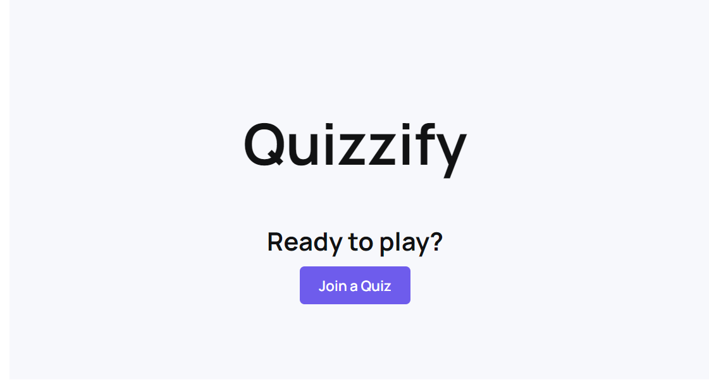

# Quizzify

  

## Project URL
https://quizzify.games/

## Project Video URL 
https://www.youtube.com/watch?v=Prm8TewCuQs

## Project Description

Quizzify is an immersive, real-time quiz platform crafted to infuse interactivity into classrooms, gatherings, and informal assemblies. Inspired by industry-leading platforms such as Kahoot, Quizzify enables endless possibilities for everybody to create, host, and play fun quiz sessions in real-time with exciting features like quiz templates and special game modes!

The main features we implemented to this project were:
- **User Registration & Login:** Securely sign up/log in with their Google account (via Auth0 + JWTs) and manage user profiles.
  - **User accounts**: Use avatar, display name, & email address from Google auth. Display a list of user’s public quizzes on their profile page.
- **Quiz Creation:** Users can create quizzes with questions and response options
  - **Question types:** single answer, multiple choice, true/false
  - **Private quiz creation:** Create quizzes that are hidden from other users and only accessible to a logged-in user who created the quiz
  - **Quiz templates:** Users can take inspiration from public quiz templates and create a copy to modify on their own
- **Live Quiz Hosting:** Host a quiz where participants (non logged in users) can join using a unique code. Utilize web sockets for real-time interactions between host and clients
  - **Public quiz mode:** Shareable code/link (unique) that non-authenticated users can access
  - **Host:** Display timer, questions, response options, user leaderboard (updates real-time during the round)
  - **Client:** Display questions & answer options
  - **Different game modes:**
    - **Classic:** Play quizzes with an standard timer that users can adjust
    - **Rapid-fire:** Accelerate question speed by a set multiplier (& award points by exponentially decreasing multiplier)
    - **Last one standing:** Three errors and you are out of the game

## Development

**Task:** Leaving deployment aside, explain how the app is built. Please describe the overall code design and be specific about the programming languages, framework, libraries and third-party api that you have used. 

### Frontend Development
- **Technologies:** React.js, Chakra UI
- Our frontend, built with React.js and styled with Chakra UI, provides an interactive and user-friendly interface. It is responsible for presenting the quiz content, handling user interactions, and ensuring a responsive design across various devices.

### Backend Development
- **Technologies:** Express (Node.js), MongoDB, Socket.io, Auth0 
  - **Express:** A web application framework for Node.js, designed for building web applications and APIs. We managed the database, endpoint and socket routing, and much more within the backend using Express
  - **Socket.io:** JavaScript library for real-time web applications, which enabled real-time, bi-directional communication between web clients and servers, a crucial aspect for the live quiz functionality in Quizzify.
  - **MongoDB:** Combined with Mongoose, an object data modeling (ODM) library for Node.js, the non-relational database allowed us to efficiently store and manage relationships between data, while providing schema validation
  - **Auth0:** 3rd party API integrated into Quizzify to manage user authentication and authorization securely. It simplifies the process of handling user credentials and permissions, ensuring that users have a secure and seamless login experience. It allowed us to secured our API endpoints by restricting access based on authorization
- The backend handles data management, server-side logic, real-time interactions between users during quizzes, and communicates with the database to store and retrieve quiz information.

### Summary
In summary, Quizzify is built using a combination of modern technologies and frameworks, each chosen for its specific strengths in creating a seamless, secure, and interactive user experience. React and Chakra UI provide an engaging user interface for the frontend, while Express, MongoDB, and Socket.io ensure robust data handling and real-time interaction capabilities within our backend. Additionally, Auth0's 3rd party integration offers a secure authentication system, completing the robust framework of Quizzify.

## Deployment

First, we dockerized our frontend and backend. Then, following instructions from Lab 9, we deployed the dockerized containers with an Nginx reverse proxy to a Google Compute Engine VM instance with the following configuration:
- **Region:** northamerica-northeast2 (Toronto)
- **Machine configuration:** E2 (Low cost, day-to-day computing)
- **Machine type:** e2-micro
  - Building & deploying the frontend sometimes required temporarily upgrading to e2-medium

Finally, we acquired the domain `quizzify.games` from [name.com](https://www.name.com/) and pointed it to a reserved static IP of our Google Cloud VM instance. By updating the domains within `quizzify/.env` to this domain, we were able to utilize Let's Encrypt SSL certificates to enable HTTPS across our application.

## Challenges

**Task:** What is the top 3 most challenging things that you have learned/developed for you app? Please restrict your answer to only three items. 

1. **Deployment**: Troubleshooting across multiple systems (Docker, Google Compute Engine, Nginx, Let's Encrypt, and our domain host [name.com](https://www.name.com/)) was a tedious and challenging task while deploying our application. 
    - With minimal prior experience deploying dockerized containers to cloud providers, we ran into numerous issues with conflicting and outdated documentation that lengthened our deployment process. Each step of the deployment process required knowledge of the technologies used and a significant amount of troubleshooting, which made this phase the most time-consuming and complex.
    - In the end, we learned how to deploy Docker containers to Google Compute Engine VM instances, configure SSL certificates with HTTPS domains and an Nginx reverse proxy, as well as managing production/development environment variables .

2. **Real-time Synchronization**: Orchestrating the real-time functionality in Quizzify presented a significant challenge, particularly in achieving seamless integration between the frontend and backend.
    - The central task was to ensure real-time interaction in the quiz games, where a host controls the game and players join in. The user interface, which players see and use to answer questions, had to be quick and responsive. It needed to be updated immediately as players interacted with the quiz. On the other hand, the backend had to manage all the quiz activities through Socket.io and MongoDB, such as emitting quiz questions and maintaining player scores, while ensuring everything was in sync for all players and the database. 
    - This demanded careful planning and execution to make sure that everyone's actions were reflected in real-time, making the game engaging and interactive. It was a balancing act of making the game fast and fun, while also handling the technical complexities of connecting everyone seamlessly.

3. **3rd-party Authorization**: Integrating Auth0 into our application required multiple days of technical challenges, primarily due to conflicting and outdated documentation (again). 
    - We went through multiple iterations of Auth0 implementations before successfully establishing a secure authentication system that connected our application across our frontend and backend, which required two distinct Auth0 setups.
      - We deployed an Auth0 single page application (SPA) for our frontend, which was then connected with a separate Auth0 API for our backend to connect with the Auth0 frontend SPA to verify authorization across our API endpoints.
    - This intricate process involved numerous iterations and errors, as we navigated through the complexities of OAuth 2.0 protocols and the secure handling of authentication tokens and user sessions. The task was not only time-consuming but also demanded a deep understanding of secure communication between the client and server. Eventually, our persistence paid off, and we successfully implemented Auth0, ensuring robust user authentication and access control in our quiz platform, and gaining valuable insights into advanced web security practices.

## Contributions

### Henry Wong
- Backend 
  - API endpoints/routing
  - Sockets
  - Authorization
- Auth0
- Deployment
- Initial project setup

### Peter Yan Tsai Chow
- Frontend
- UI/UX design
